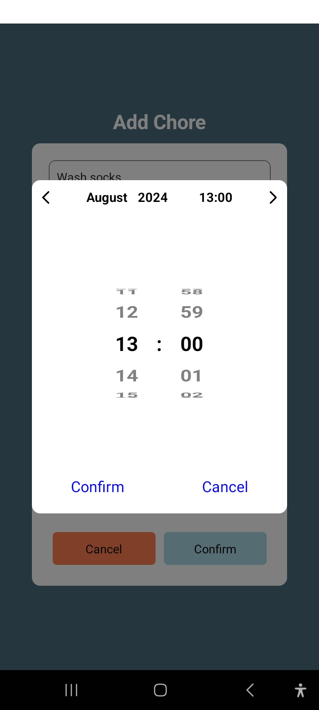
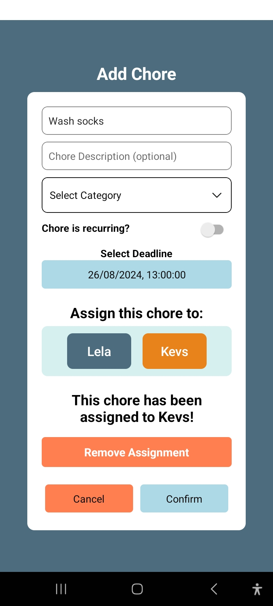
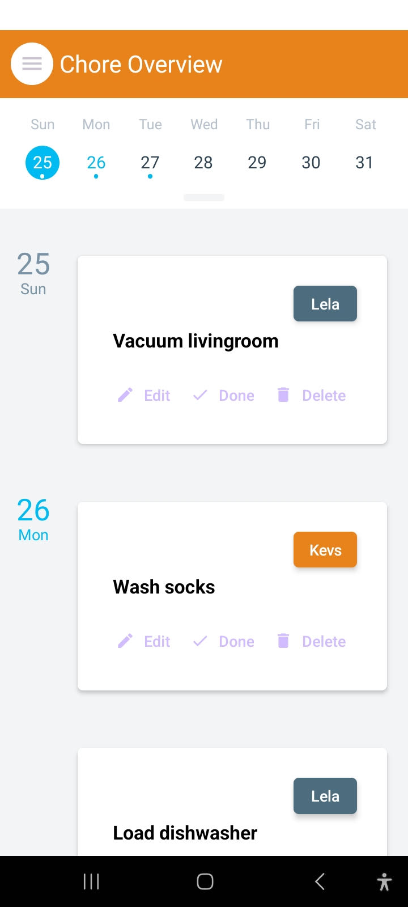
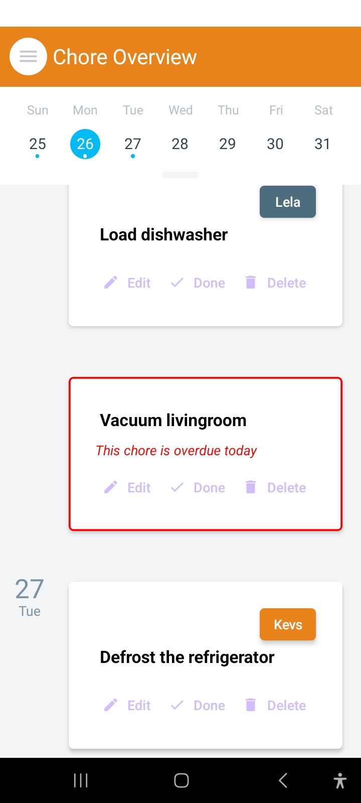

# About ChoreLove
This is a simple mobile app built with React Native and Expo Go. It's meant for multiple users to coordinate household chores and give a clear overview of what needs to be done.

## Features

  

### Create and Assign Chores
Users can create new chores and assign them to either themselves or someone else in the family.

### Edit Chores
A chore can be edited by updating the deadline, changing the name, adding notes, or updating which user is assigned to this chore.

### Set Deadlines
A chore can be assigned a deadline to keep everyone on track. Did you wash those socks yet?

### Agenda Overview
With just a quick look, you can view all the chores for the day, previous day, or upcoming days and be good to go.

  
  

  
  

